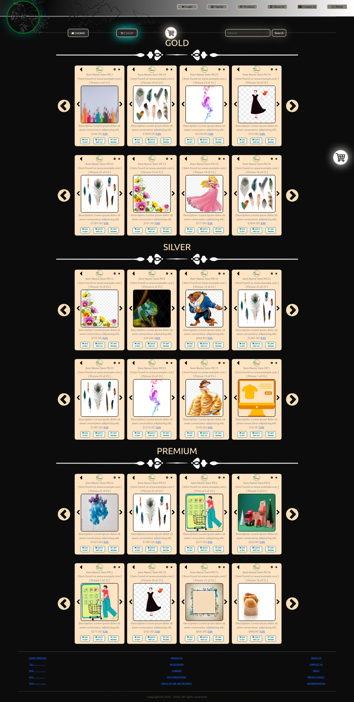
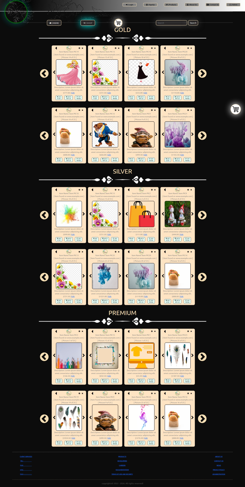

# Vanille Online Store

A simple responsive SPA web app of an online store (ecommerce), with vanilla JS, jQuery, jQuery-UI, Bootstrap, HTML, CSS, Emailjs and Firebase Real-time databse.

## How to run the app

* Clone the code to your local
* Go to [EmailJS](https://www.emailjs.com/), create an account, a service and an email template, get the service and email names and your public key from the dashboard.
* Go to [Google](https://firebase.google.com/) and create a firebase Real-time database. Get your firebase configuration.
* Go to [RAWG](https://rawg.io/apidocs), create an acount and get an api key.
* Plug these details in the env.example.js files and remove the example from file names to have env.js. You might need to activate ('uncomment, I mean 😁') the emailjs and firebase code both in their respective modules and in wywm.mjs. Then you are good to go!

## Sceenshots of build so far

* Open to suggestions and improvements! Have fun!!!
